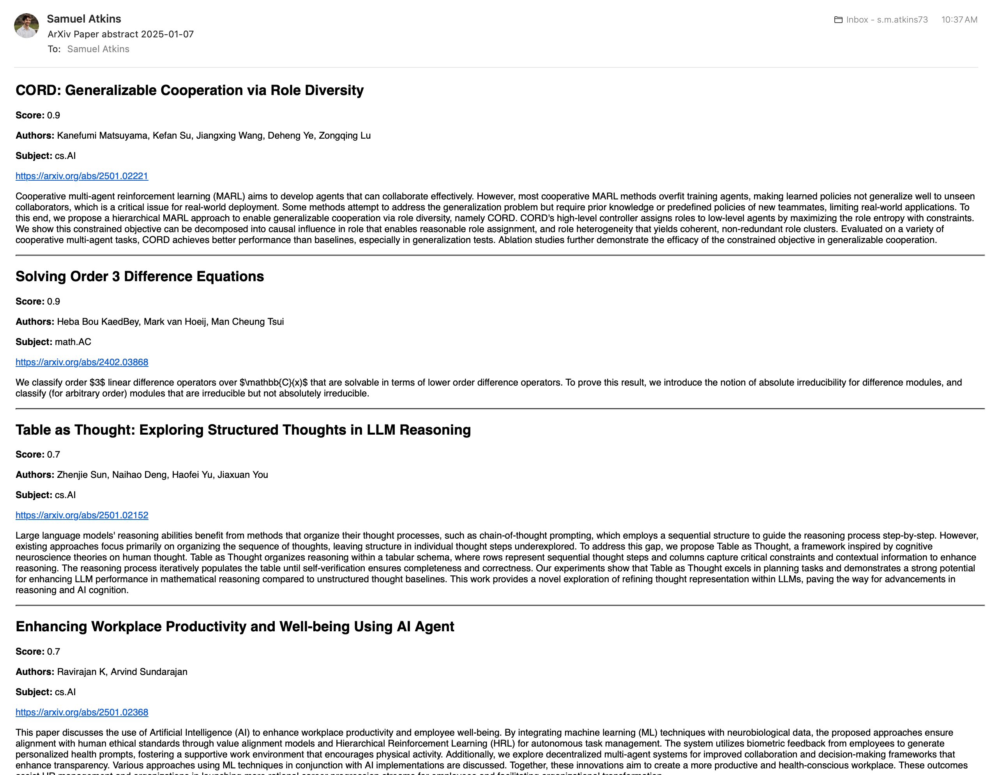

# arXiv Sorter

This repository allows you to get a curated feed of research articles according to your research goals. Each morning, it will send you an email with ranked paper recommendations according to the details you provide in `context/prompt.txt` and the subjects you specify in `context/subjects.txt`.



_Figure 1: Sample result email given the default prompt and subjects_

To configure this repository, follow these steps.

1. Install the dependencies in the `requirements.txt` file.
2. Specify your OpenAI API key in the .env file.
3. Specify your Google email address in the .env file.
4. Set your subjects and prompt by following the guide below.
5. Configure the Gmail API by following [this](https://developers.google.com/gmail/api/quickstart/python) guide and then save your `credentials.json` to the root directory.
6. Add the following crontab entry to run the `run.py` script every morning at 8am:

```bash
0 8 * * * cd ~/projects/arxiv-sorter && source .venv/bin/activate && python run.py
```

# Set Subjects

Go into the `context/subjects.txt` file and specify the subjects that you are interested in using their abbreviated code on each line. For example, a valid `subjects.txt` file might look like this:

```txt
cs.AI
cs.AR
econ.EM
math.AC
```

For a list of subject codes, consult the archive taxonomy reference below.

**Archive Taxonomy Reference:** https://arxiv.org/category_taxonomy

# Set Prompt

Modify the `context/prompt.txt` file to provide the LLM with context about who you are, what kinds of papers you are interested in, and what sorts of things the model should look for. Look at the current `prompt.txt` content for inspiration.
